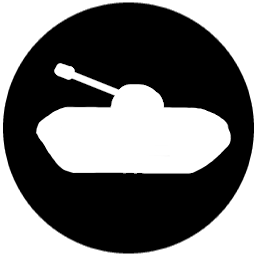

# Tančíky / Tankettes

## Notes:

1. File usage:

	- `Serialization/Serializer.cs` - used for saving/loading
	game state

	- (loading game assets in `Client/Renderer.cs`)

1. Multithreading usage:

	- `Client/BackgroundSaver.cs` - uses a background task to save
	current game state

	- `GameLogic/Terrain.cs` - procedural terrain generation uses parallel
	programming to perform iterations of the perlin noise algorithm
	indenpendently
	(it's much slower than the sequential version given the small input
	values... **but it's the thought that counts!**)
